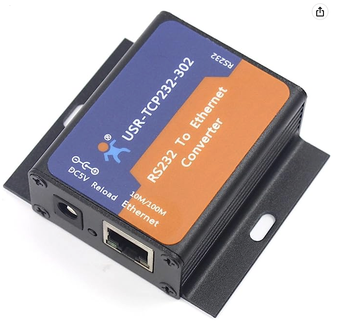
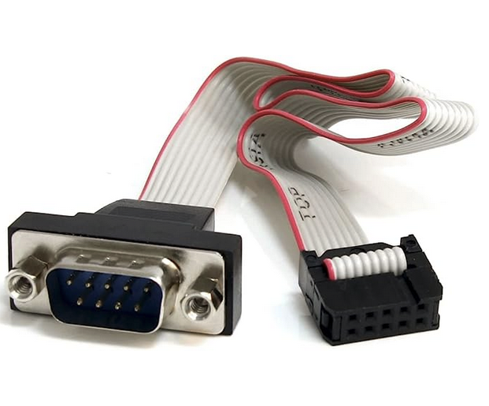
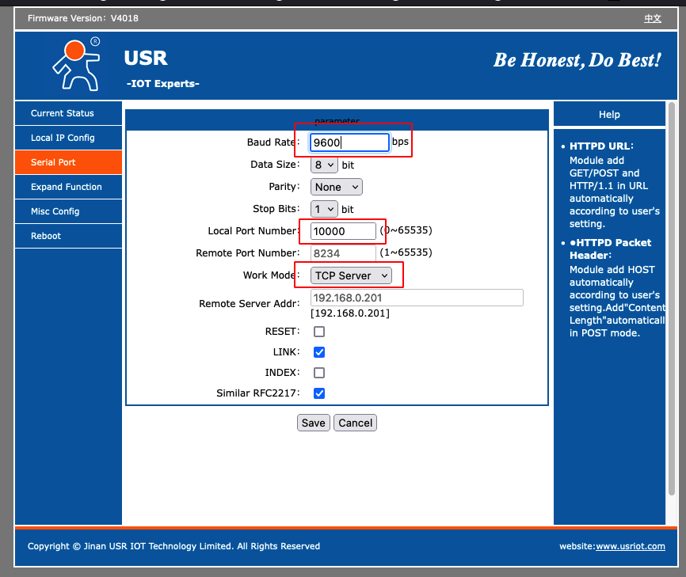
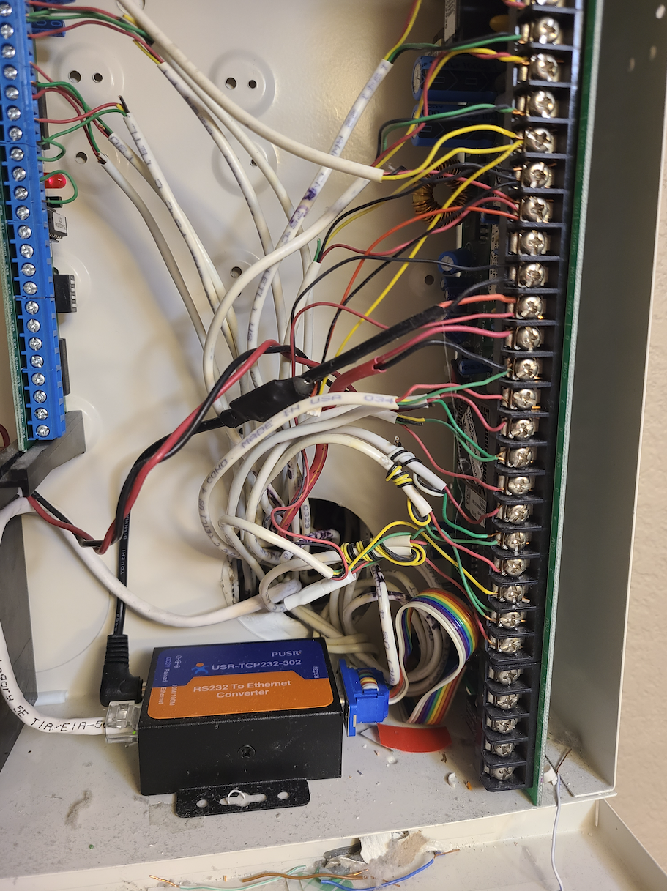

UPDATES:

1. I was getting errors when I tried to install the add-on in HA. Based on the post from balda at https://community.home-assistant.io/t/errors-when-buliding-a-new-addon/198841/17, there needs to be a build.json file in the nx584 directory. I added one to my fork and it now installs fine.

2. I was also having issues getting the USR 302 to connect to my NX-8E. It turns out because the USR 302 uses a female plug tx and rx might be reversed. I am using what I think is the original P-0003 DIN 10 to DB9 adapter to connect serial to the NX-8E which should be a straight through connection. It has a male end like a PC and can connect directly to the USR 302 without having to us a null cable modem or switching tx/rx. End story is MAKE SURE YOU HAVE YOUR WIRING CORRECT!. Below are some resources on the pinouts but I haven't found any that are clear on exact pinouts so trial an error might be necessary.

http://www.increa.com/reverse/nx-8e/index.html

https://wiki.linuxmce.org/index.php/Caddx_NX-8E

https://forums.homeseer.com/forum/security-systems-plug-ins/security-system-discussion/caddx-rien-du-pre/85534-caddx-plugin/page8

# NX-8E Home Assistant Add-on

This is a very simple Home Assistant add-on for the [NX584/NX-8E Interface Server](https://github.com/kk7ds/pynx584)

## Setting Serial to TCP/IP 

I'm using Serial to TCP/IP to connect to the RS232 of the my NX8E. You can buy this on Amazon.com for around $26 and RS232 serial cable. 

Amazon Link: https://a.co/d/8SudbqT





* You don't need to install any software for this item to work. It has a web based configuration that you can use to adjust the settings. 
* First, you just need to connect it to your computer directly using ethernet cable. 
* This device has static IP address assigned which is 192.168.0.7, so all you have to do is setup your computer to have static address on similar subnet for example: 192.168.0.2 and subnet of 255.255.255.0. 
* Open any browser and visit http://192.168.0.7. Username: admin, Password: admin. 
* Click the `Local IP Config` and set the IP Type to DHCP. Click Save. Don't click the Restart Module yet. 
* Click the `Serial Port` and adjust the following parameters similar below and click save. 



* You can now remove the device from your PC. From here you can move the device to you alarm panel, connect the serial cable, ethernet to your switch hub and the power cable. On my setup, I'm using power cable that I made which has step-down DC converter (12v to 5v) so I don't need to use separate power source. This mod not required, you can just use the included 5v power adapter. 





* Fork this repository (this is necesary, because currently this add-on does not have any user configuration)
* Refer to the [configuration documentation](https://github.com/kk7ds/pynx584) of the NX584 server and:
  * Change [config.ini](nx584/config.ini) to describe your NX panel configuration (number of zones, zone names, ES vs US date-time format, etc.)
  * Change [run.sh](nx584/run.sh) to reflect how you'll connect the NX584 server to the NX pannel. (Where it says `--connect usr-tcp232-302:10000`)
* Push your changes to your forked repository
* Add your forked repository as a [Third-Party Add-On in Home Assistant](https://www.home-assistant.io/common-tasks/os#installing-third-party-add-ons)
* [Configure your NX584 Alarm Panel and Binary Sensors](https://www.home-assistant.io/integrations/nx584/) in Home Assistant
* Restart HA. 


**HINT**: If the add-on was installed successfully, you should see something like this in the `Logs` section of the add-on:
```
s6-rc: info: service s6rc-oneshot-runner: starting
s6-rc: info: service s6rc-oneshot-runner successfully started
s6-rc: info: service fix-attrs: starting
s6-rc: info: service fix-attrs successfully started
s6-rc: info: service legacy-cont-init: starting
s6-rc: info: service legacy-cont-init successfully started
s6-rc: info: service legacy-services: starting
s6-rc: info: service legacy-services successfully started
2022-09-11 13:32:40,591 main INFO Ready
2022-09-11 13:32:40,654 controller INFO Loaded extensions []
 * Serving Flask app 'nx584'
 * Debug mode: off
2022-09-11 13:32:40,668 _internal INFO WARNING: This is a development server. Do not use it in a production deployment. Use a production WSGI server instead.
 * Running on all addresses (0.0.0.0)
 * Running on http://127.0.0.1:5007
 * Running on http://172.30.33.3:5007
2022-09-11 13:32:40,669 _internal INFO Press CTRL+C to quit
2022-09-11 13:32:40,733 controller INFO Connected
2022-09-11 13:32:40,734 controller INFO Connected
2022-09-11 13:32:41,184 _internal INFO 172.30.32.1 - - [11/Sep/2022 13:32:41] "GET /partitions HTTP/1.1" 200 -
2022-09-11 13:32:41,790 controller INFO Zone 2 (VZ/Others) state is NORMAL
2022-09-11 13:32:42,013 controller INFO Zone 3 (VZ/Stairs) state is NORMAL
2022-09-11 13:32:42,192 controller INFO Zone 4 (VZ/Bedroom) state is NORMAL
2022-09-11 13:32:42,860 controller INFO System asserts Valid partition 1
2022-09-11 13:32:42,861 controller ERROR System asserts Fail to communicate
2022-09-11 13:32:42,862 controller INFO System asserts AC power on
2022-09-11 13:32:43,530 controller INFO Zone 1 (VZ/Door) state is NORMAL
2022-09-11 13:32:43,534 _internal INFO 172.30.32.1 - - [11/Sep/2022 13:32:43] "GET /events?index=226&timeout=60 HTTP/1.1" 200 -
2022-09-11 13:32:44,201 controller INFO Zone 2 (VZ/Others) state is NORMAL
2022-09-11 13:32:44,205 _internal INFO 172.30.32.1 - - [11/Sep/2022 13:32:44] "GET /events?index=226&timeout=60
```

# Troubleshooting

If you get a log saying no reusable address, you might need to switch from DNS name `usr-tcp232-302` to the actual IP address and re-install. 
